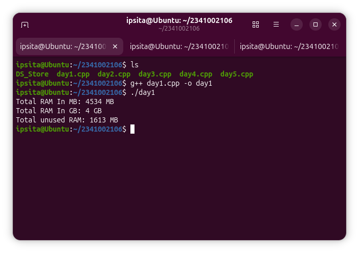
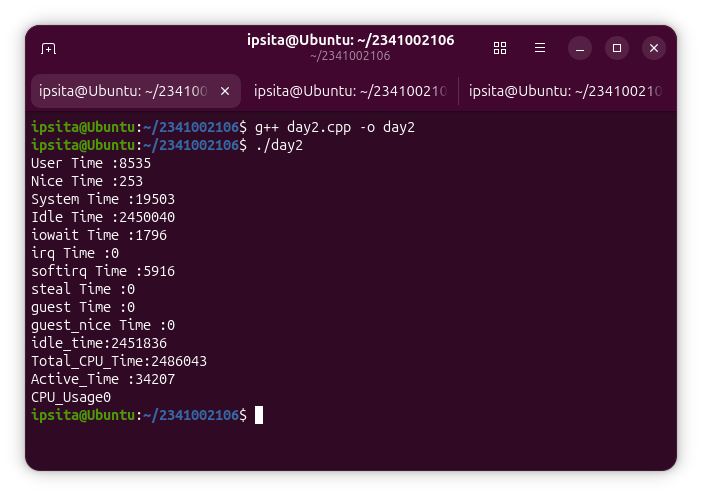
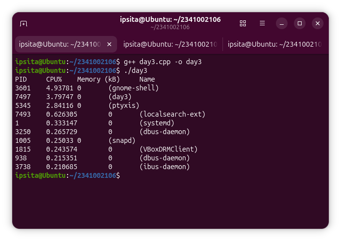
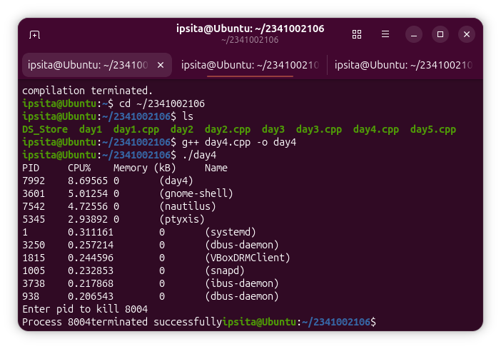
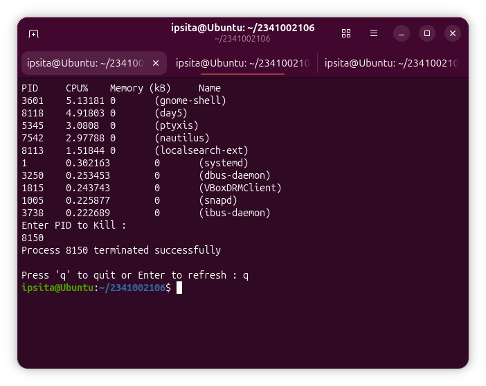

# Linux System & Process Monitoring Tool using C++ on Ubuntu

A terminal-based system and process monitor written in **C++17** for **Ubuntu Linux**. It reads live data from the Linux kernel (`sysinfo()` and the `/proc` filesystem), shows memory, CPU and process information, ranks the top processes, and lets the user terminate a process by PID.

> **Wipro Training Project** — developed over 5 days, one stage per day.


---

## Table of Contents

- [Features](#features)
- [Project Structure](#project-structure)
- [Day-wise Development](#day-wise-development)
- [How It Works](#how-it-works)
- [Technologies Used](#technologies-used)
- [Getting Started](#getting-started)
- [Usage](#usage)
- [Screenshots](#screenshots)
- [Known Limitations](#known-limitations)
- [Future Scope](#future-scope)
- [Author](#author)

---

## Features

- Display total RAM (MB and GB) and unused RAM
- Read CPU counters from `/proc/stat` and calculate total, idle and active time
- List all active processes with PID, name, CPU % and memory (VmRSS)
- Sort processes by CPU or memory usage
- Terminate a process by PID using `kill()` with `SIGKILL`
- Continuous monitor: top 10 CPU-consuming processes, press **Enter** to refresh, **q** to quit

## Project Structure

```
.
├── day1.cpp          # Memory monitoring (sysinfo)
├── day2.cpp          # CPU statistics (/proc/stat)
├── day3.cpp          # Active process monitoring and sorting
├── day4.cpp          # Process termination (kill / SIGKILL)
├── day5.cpp          # Final continuous process monitor
├── screenshots/      # Ubuntu terminal output for each day
└── README.md
```

Each file is a standalone program that builds on the previous day. `day5.cpp` is the final version.

## Day-wise Development

| Day | Stage | What was implemented |
|-----|-------|----------------------|
| 1 | Memory monitoring | `sysinfo()` from `<sys/sysinfo.h>`; total RAM in MB/GB and unused RAM |
| 2 | CPU monitoring | Parse the first line of `/proc/stat` (user, nice, system, idle, iowait, irq, softirq, steal, guest, guest_nice); compute total, idle and active time and CPU usage |
| 3 | Process monitoring | Traverse numeric folders under `/proc`; PID and name from `/proc/[PID]/stat`; memory from `VmRSS` in `/proc/[PID]/status`; per-process CPU %; store in a `vector` and sort by CPU or memory |
| 4 | Process termination | Show top processes, read a PID, terminate it with `kill(pid, SIGKILL)` |
| 5 | Continuous monitor | Combine everything in a loop: refresh, show top 10 by CPU, accept a PID to kill, **Enter** to refresh, **q** to quit, 2-second wait between refreshes |

## How It Works

```
Linux kernel                C++17 modules                 Terminal
────────────                ─────────────                 ────────
sysinfo()          ──►      Memory module        ──►      Memory summary
/proc/stat         ──►      CPU module           ──►      CPU summary
/proc/[PID]/stat   ──►      Process module       ──►      Top 10 by CPU
/proc/[PID]/status ──►      (vector + sort)
                            Control module (kill) ◄──     PID / Enter / q
```

**CPU time (Day 2)**

```
idle_time  = idle + iowait
total_time = sum of all CPU counters
active     = total_time - idle_time
usage %    = active / total_time * 100
```

**Process CPU % (Day 3)**

```
total_ticks = utime + stime                       (fields 14 and 15 of /proc/[PID]/stat)
seconds     = system_uptime - starttime / sysconf(_SC_CLK_TCK)
cpu %       = (total_ticks / sysconf(_SC_CLK_TCK)) / seconds * 100
```

This is the average CPU usage over the process's lifetime.

## Technologies Used

- **Language:** C++17
- **Platform:** Ubuntu Linux
- **Linux interfaces:** `/proc` filesystem, POSIX APIs, `sysinfo()`, `sysconf()`, `kill()`, `SIGKILL`
- **C++ standard library:** `vector`, `algorithm`, `filesystem`, `ifstream`, `stringstream`, `thread`, `chrono`

## Getting Started

### Prerequisites

- Ubuntu Linux (or another Linux distribution with `/proc`)
- `g++` with C++17 support

```bash
sudo apt update
sudo apt install build-essential
```

### Clone and build

```bash
git clone https://github.com/ipsitabehera569/Linux-process-monitoring/<Ipsita_Behera>/<Linux-process-monitoring>.git
cd <Linux-process-monitoring>

g++ -std=c++17 day1.cpp -o day1
g++ -std=c++17 day2.cpp -o day2
g++ -std=c++17 day3.cpp -o day3
g++ -std=c++17 day4.cpp -o day4
g++ -std=c++17 day5.cpp -o day5
```

## Usage

Run any stage:

```bash
./day1    # memory
./day2    # CPU counters
./day3    # top 10 processes
./day4    # top 10 processes + kill by PID
./day5    # continuous monitor (final)
```

**Final monitor (`./day5`)**

1. The top 10 processes by CPU are displayed.
2. Enter a PID to terminate it, or `0` to skip.
3. Press **Enter** to refresh the list, or **q** to quit.
4. The screen refreshes after a 2-second wait.

> ⚠️ **Warning:** `SIGKILL` cannot be caught or ignored. Only terminate processes you own and understand. Killing system processes can crash your session. Run the tool in a virtual machine while testing.

## Screenshots

| Day 1 – Memory | Day 2 – CPU |
|---|---|
|  |  |

| Day 3 – Processes | Day 4 – Kill by PID |
|---|---|
|  |  |

**Day 5 – Continuous monitor**


## Known Limitations

- Process CPU % is a lifetime average, not the current usage.
- `day5.cpp` does not validate negative PIDs (`day4.cpp` checks `PID > 0`).
- The screen refreshes after you press Enter, not on a background timer.

*(Update this list as you fix issues.)*

## Future Scope

- Real-time CPU usage by comparing two samples
- `ncurses`-based interactive interface
- Try `SIGTERM` before `SIGKILL`
- Search and filter processes by name or user
- Disk and network monitoring

## Author

**Ipsita Behera**
Roll No: 2341002106
Department of Computer Science and Engineering
Training Organization: Wipro

## License

This project was created for educational purposes as part of Wipro training.
